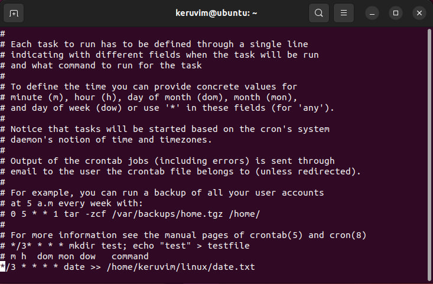

# Задание
1.  Используйте команды операционной системы Linux и создайте две новых директории – «Игрушки для школьников» и «Игрушки для дошколят»

2.   Создайте в директории «Игрушки для школьников» текстовые файлы - «Роботы», «Конструктор», «Настольные игры»

3.    Создайте в директории «Игрушки для дошколят» текстовые файлы «Мягкие игрушки», «Куклы», «Машинки»

4.   Объединить 2 директории в одну «Имя Игрушки»

5.   Переименовать директорию «Имя Игрушки» в «Игрушки»

6.   Просмотреть содержимое каталога «Игрушки».

7.   Установить и удалить snap-пакет. (Любой, какой хотите)

8.   Добавить произвольную задачу для выполнения каждые 3 минуты (Например, запись в текстовый файл чего-то или копирование из каталога А в каталог Б).
